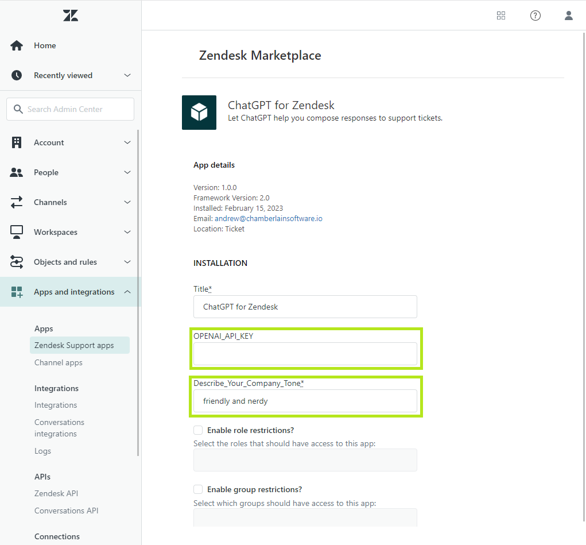
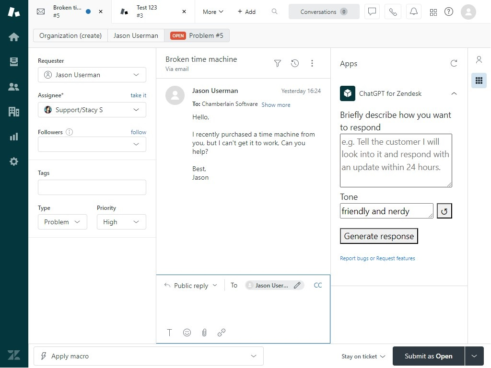
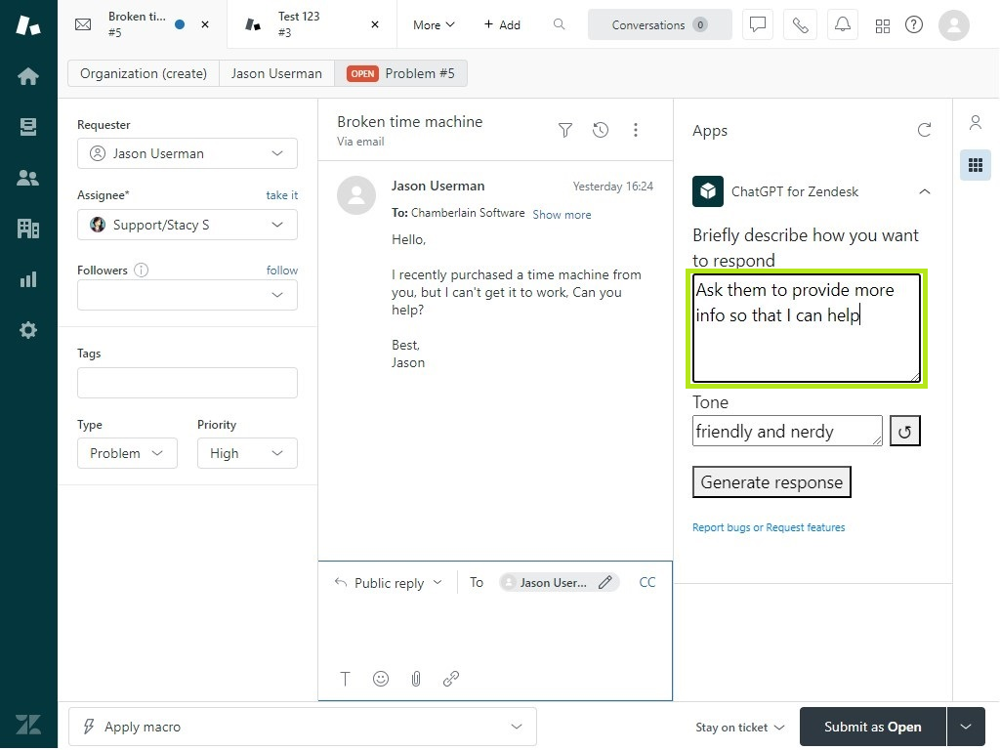
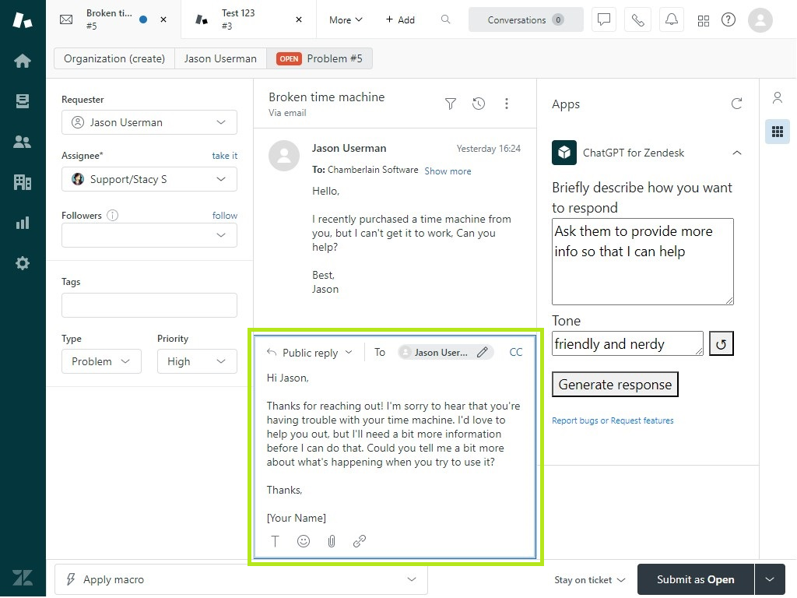

# ChatGPT for Support

Use ChatGPT to help your support agents respond to customers!

### Setup Instructions
* After installing the app, you should be prompted to enter some configuration settings.
    * If you are not prompted, you can find your installed apps by following these instructions: (Accessing the My Apps page)[https://support.zendesk.com/hc/en-us/articles/4409155946906-Accessing-the-My-Apps-page-for-your-installed-Support-apps]
    * Then you can edit the app settings by following these instructions: (Managing your installed apps: Changing app settings)[https://support.zendesk.com/hc/en-us/articles/4409155972378#topic_kly_zt4_ym]
* Be sure to enter your OpenAI API Key. (This field is required even though Zendesk doesn't mark it with a *)
    * You can obtain your own API key by logging into platform.openai.com and going here: https://platform.openai.com/account/api-keys
    * If you prefer, we can provide you with an API key. Please contact us for details.
* Also be sure to describe your company tone. This tells the app what tone to use when generating responses to customers.

* Edit any other fields as desired.
* Be sure to save your changes.

### How to use it:
* Open a support ticket. On the right side, you should see the ChatGPT for Support app. If not, click the grid icon on the far right to display your apps.
* Read the ticket thread.
* In the right side bar, briefly describe how you would respond. e.g. "Ask them to provide more info so I can investigate the issue."
* If desired, modify the default tone.
* Click "Generate response"
* After a few seconds, a draft response will be populated in the reply text box.
* You can review the draft response, make edits if needed, then send it.

### Screenshots:
On the right side, briefly describe how you want to respond: 

For example: 

Adjust the Tone if desired, then click "Generate response" and wait for the draft response to appear in the reply box: 

### Help us get better!
Please submit bug reports and feature requests to our [Issue Tracker](https://github.com/weineran/chatgpt-zendesk-issues/issues).

Copyright Andrew Weiner 2023 All Rights Reserved
